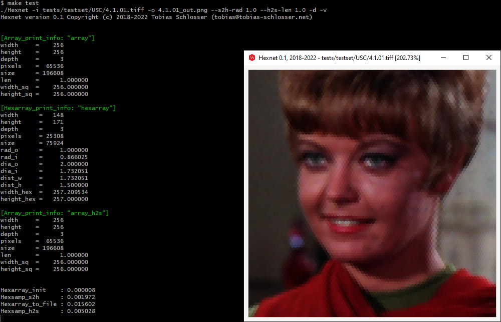

Hexnet - _The_ Hexagonal Image Processing Framework
===================================================


[](https://travis-ci.com/TSchlosser13/Hexnet)


[](https://github.com/TSchlosser13/Hexnet/blob/master/LICENSE.txt)


---

This is the base system of this project for hexagonal transformation and visualization.

For **_The_ Hexagonal Machine Learning Module** of this project see [_ML/](_ML/).

---





Installation
------------

### Linux

```
sudo apt-get install libepoxy-dev libgtk-3-dev libxml2-utils
```

Install ImageMagick

```
sudo apt-get install libjpeg-dev libpng-dev libtiff-dev
# https://imagemagick.org/script/install-source.php
wget https://imagemagick.org/download/ImageMagick.tar.gz
mkdir ImageMagick
tar xvzf ImageMagick.tar.gz --directory ImageMagick --strip-components 1
cd ImageMagick
./configure
make
sudo make install
sudo ldconfig /usr/local/lib
cd ..
```


### Windows

Install MSYS2: https://www.msys2.org/

```
pacman -S base-devel git mingw-w64-x86_64-gtk3 mingw-w64-x86_64-libepoxy mingw-w64-x86_64-toolchain
```

Install ImageMagick

```
# https://imagemagick.org/script/install-source.php
wget https://imagemagick.org/download/ImageMagick.tar.gz
mkdir ImageMagick
tar xvzf ImageMagick.tar.gz --directory ImageMagick --strip-components 1
cd ImageMagick
./configure LDFLAGS="-lws2_32"
make
make install
cd ..
```


### Hexnet

Standalone

```
make Hexnet
```

Shared object for **_The_ Hexagonal Machine Learning Module** of this project

```
make Hexnet.so
```

Install Hexnet

```
make install
```


Usage
-----

```
./Hexnet --help
```

```
Hexnet version 0.1 Copyright (c) 2018-2024 Tobias Schlosser (tobias@tobias-schlosser.net)
Usage: ./Hexnet [options]

-h, --help                            print options
-i, --input       <image>             square or hexagonal pixel based input image
-o, --output      <image>             hexagonal pixel based output image (s2h); h2s, h2h, and s2s output images' base name
--s2h-rad         <radius>            enable square to hexagonal image transformation by setting the hexagonal pixels' outer radius
--h2s-len         <length>            enable hexagonal to square image transformation by setting the square pixels' side length
--h2h-rad         <radius>            enable hexagonal to hexagonal image transformation by setting the hexagonal pixels' outer radius
--s2s-res         <width> [<height>]  enable square to square image transformation by setting the output resolution
--compare-s2s     <image>             compare square input (i, input) to input square image <image>
--compare-s2h                         compare square input (i, input) to hexagonal output image (o, output) using s2h-rad
--compare-metric  <metric>            compare-s2s and compare-s2h compare metric: AE / SE / MAE / MSE / RMSE / PSNR / SSIM / DSSIM
-d, --display                         display hexagonal input (i, input) or output image (o, output) using s2h-rad
-v, --verbose                         increase verbosity
```


Test
----

```
make test
```


License
-------

[MIT License](LICENSE.txt)


Funding
-------

The European Union and the European Social Fund for Germany partially funded this research.


