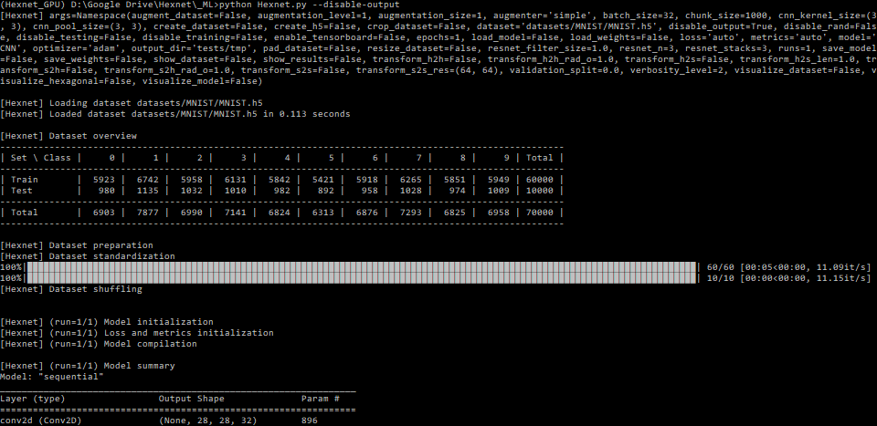

Hexnet: _The_ Hexagonal Machine Learning Module
===============================================


[](https://travis-ci.com/TSchlosser13/Hexnet)


[](https://github.com/TSchlosser13/Hexnet/blob/master/_ML/LICENSE.txt)


---

This is **_The_ Hexagonal Machine Learning Module** of this project.

For the base system of this project for hexagonal transformation and visualization see [../](https://github.com/TSchlosser13/Hexnet).

---





Installation
------------

### GPU

```
conda create -n Hexnet_GPU python=3.7 -c conda-forge --file requirements_GPU_conda.txt
conda activate Hexnet_GPU
pip install -r requirements_GPU_pip.txt
```


"requirements_GPU_conda.txt" and "requirements_GPU_pip.txt" were generated via

```
conda list --export > requirements_GPU_conda.txt
```

and

```
pip list --format=freeze > requirements_GPU_pip.txt
```

with

```
cudatoolkit=10.1.243
cudnn=7.6.5
imgaug=0.3.0
```

and

```
natsort==7.0.1
pandas==1.0.5
protobuf==3.20.1
scikit-learn==0.23.1
seaborn==0.10.1
tensorflow-gpu==2.1.0
tqdm==4.47.0
```

(12/09/2022)


### CPU

```
conda create -n Hexnet_CPU python=3.7 -c conda-forge --file requirements_CPU_conda.txt
conda activate Hexnet_CPU
pip install -r requirements_CPU_pip.txt
```


"requirements_CPU_conda.txt" and "requirements_CPU_pip.txt" were generated via

```
conda list --export > requirements_CPU_conda.txt
```

and

```
pip list --format=freeze > requirements_CPU_pip.txt
```

with

```
imgaug=0.3.0
```

and

```
natsort==7.0.1
pandas==1.0.5
protobuf==3.20.1
scikit-learn==0.23.1
seaborn==0.10.1
tensorflow==2.1.0
tqdm==4.47.0
```

(12/09/2022)


Getting started: 30 seconds to Hexnet
-------------------------------------

Implement your own square and hexagonal lattice format based models in models/models.py ...

```
import tensorflow as tf

from tensorflow.keras        import Sequential
from tensorflow.keras.layers import Conv2D, Dense, Dropout, Flatten, MaxPool2D

from layers.layers import HConv2D, HMaxPool2D, SConv2D, SMaxPool2D


def model_SCNN_test(input_shape, classes, kernel_size, pool_size):
	model = Sequential()

	model.add(SConv2D(filters=32, kernel_size=kernel_size, padding='SAME', activation=tf.nn.relu, input_shape=input_shape))
	model.add(SMaxPool2D(pool_size=pool_size, padding='SAME'))
	model.add(Dropout(rate=0.25))
	model.add(SConv2D(filters=64, kernel_size=kernel_size, padding='SAME', activation=tf.nn.relu))
	model.add(SMaxPool2D(pool_size=pool_size, padding='SAME'))
	model.add(Dropout(rate=0.25))
	model.add(Flatten())
	model.add(Dense(units=128, activation=tf.nn.relu))
	model.add(Dropout(rate=0.5))
	model.add(Dense(units=classes, activation=tf.nn.softmax))

	return model


def model_HCNN_test(input_shape, classes, kernel_size, pool_size):
	model = Sequential()

	model.add(HConv2D(filters=32, kernel_size=kernel_size, padding='SAME', activation=tf.nn.relu, input_shape=input_shape))
	model.add(HMaxPool2D(pool_size=pool_size, padding='SAME'))
	model.add(Dropout(rate=0.25))
	model.add(HConv2D(filters=64, kernel_size=kernel_size, padding='SAME', activation=tf.nn.relu))
	model.add(HMaxPool2D(pool_size=pool_size, padding='SAME'))
	model.add(Dropout(rate=0.25))
	model.add(Flatten())
	model.add(Dense(units=128, activation=tf.nn.relu))
	model.add(Dropout(rate=0.5))
	model.add(Dense(units=classes, activation=tf.nn.softmax))

	return model
```


... or extend already implemented models ...

```
from models.resnets import model_SResNet_v2, model_HResNet_v2

def model_SResNet_v2_test(input_shape, classes, n=2):
	return model_SResNet_v2(input_shape, classes, n)

def model_HResNet_v2_test(input_shape, classes, n=2):
	return model_HResNet_v2(input_shape, classes, n)
```


These are then deployed using ...

```
python Hexnet.py --model HResNet_v2
```


For help, see ...

```
python Hexnet.py --help
```

```
usage: Hexnet.py [-h] [--disable-training] [--disable-testing]
                 [--disable-output] [--enable-tensorboard]
                 [--model [{...}]]
                 [--load-model LOAD_MODEL] [--load-weights LOAD_WEIGHTS]
                 [--save-model] [--save-weights] [--dataset [DATASET]]
                 [--create-dataset CREATE_DATASET] [--disable-rand]
                 [--rand-seed RAND_SEED] [--create-h5]
                 [--resize-dataset RESIZE_DATASET]
                 [--crop-dataset CROP_DATASET] [--pad-dataset PAD_DATASET]
                 [--augment-dataset {train,test} [{train,test} ...]]
                 [--augmenter [{complex_custom,simple,simple_hex_custom}]]
                 [--augmentation-level AUGMENTATION_LEVEL]
                 [--augmentation-size AUGMENTATION_SIZE]
                 [--chunk-size CHUNK_SIZE] [--output-dir [OUTPUT_DIR]]
                 [--show-dataset] [--visualize-dataset] [--visualize-model]
                 [--visualize-colormap VISUALIZE_COLORMAP]
                 [--classes-per-set CLASSES_PER_SET]
                 [--samples-per-class SAMPLES_PER_CLASS] [--visualize-square]
                 [--visualize-hexagonal] [--show-results]
                 [--optimizer OPTIMIZER] [--metrics [METRICS [METRICS ...]]]
                 [--batch-size BATCH_SIZE] [--epochs EPOCHS]
                 [--loss {auto,MSE_s2h,MSE_s2s,MSE_test,keras_BinaryCrossentropy,keras_CategoricalCrossentropy,keras_CategoricalHinge,keras_CosineSimilarity,keras_Hinge,keras_Huber,keras_KLDivergence,keras_LogCosh,keras_MeanAbsoluteError,keras_MeanAbsolutePercentageError,keras_MeanSquaredError,keras_MeanSquaredLogarithmicError,keras_Poisson,keras_SparseCategoricalCrossentropy,keras_SquaredHinge}]
                 [--runs RUNS] [--validation-split VALIDATION_SPLIT]
                 [--cnn-kernel-size CNN_KERNEL_SIZE [CNN_KERNEL_SIZE ...]]
                 [--cnn-pool-size CNN_POOL_SIZE [CNN_POOL_SIZE ...]]
                 [--resnet-stacks RESNET_STACKS] [--resnet-n RESNET_N]
                 [--resnet-filter-size RESNET_FILTER_SIZE]
                 [--verbosity-level VERBOSITY_LEVEL]
                 [--transform-s2h [TRANSFORM_S2H]]
                 [--transform-h2s [TRANSFORM_H2S]]
                 [--transform-h2h [TRANSFORM_H2H]]
                 [--transform-s2s [TRANSFORM_S2S]]
                 [--transform-s2h-rad-o TRANSFORM_S2H_RAD_O]
                 [--transform-h2s-len TRANSFORM_H2S_LEN]
                 [--transform-h2h-rad-o TRANSFORM_H2H_RAD_O]
                 [--transform-s2s-res TRANSFORM_S2S_RES [TRANSFORM_S2S_RES ...]]

Hexnet: The Hexagonal Machine Learning Module

optional arguments:
  -h, --help            show this help message and exit
  --disable-training    disable training
  --disable-testing     disable testing
  --disable-output      disable training and test results' output
  --enable-tensorboard  enable TensorBoard
  --model [{...}]
                        model for training and testing: choices are generated
                        from models/models.py (providing no argument disables
                        training and testing)
  --load-model LOAD_MODEL
                        load model from HDF5
  --load-weights LOAD_WEIGHTS
                        load model weights from HDF5
  --save-model          save model as HDF5
  --save-weights        save model weights as HDF5
  --dataset [DATASET]   load dataset from HDF5 or directory
  --create-dataset CREATE_DATASET
                        create classification dataset from dataset using
                        "{set:fraction}" (e.g., "{'train':0.9,'test':0.1}")
  --disable-rand        classification dataset creation: disable randomized
                        file dataset set assignment
  --rand-seed RAND_SEED
                        classification dataset creation: seed for randomized
                        file dataset set assignment
  --create-h5           save dataset as HDF5
  --resize-dataset RESIZE_DATASET
                        resize dataset using "HxW" (e.g., 32x32)
  --crop-dataset CROP_DATASET
                        crop dataset using "HxW" with offset "+Y+X" (e.g.,
                        32x32+2+2, 32x32, or +2+2)
  --pad-dataset PAD_DATASET
                        pad dataset using "T,B,L,R" (e.g., 2,2,2,2)
  --augment-dataset {train,test} [{train,test} ...]
                        dataset set(s) for augmentation
  --augmenter [{complex_custom,simple,simple_hex_custom}]
                        augmenter: choices are generated from
                        misc/augmenters.py
  --augmentation-level AUGMENTATION_LEVEL
                        augmentation level
  --augmentation-size AUGMENTATION_SIZE
                        augmentation dataset set(s) size factor
  --chunk-size CHUNK_SIZE
                        preprocessing chunk size
  --output-dir [OUTPUT_DIR]
                        training and test results' output directory (providing
                        no argument disables the output)
  --show-dataset        show the dataset
  --visualize-dataset   visualize the dataset after preprocessing and
                        augmentation
  --visualize-model     visualize the model's filters, feature maps, and
                        activations after training
  --visualize-colormap VISUALIZE_COLORMAP
                        visualization color map (e.g., viridis)
  --classes-per-set CLASSES_PER_SET
                        classes per set to visualize
  --samples-per-class SAMPLES_PER_CLASS
                        samples per class to visualize
  --visualize-square    visualize as square arrays
  --visualize-hexagonal
                        visualize as hexagonal arrays
  --show-results        show the test results
  --optimizer OPTIMIZER
                        optimizer for training
  --metrics [METRICS [METRICS ...]]
                        metrics for training and testing
  --batch-size BATCH_SIZE
                        batch size for training and testing
  --epochs EPOCHS       epochs for training
  --loss {auto,MSE_s2h,MSE_s2s,MSE_test,keras_BinaryCrossentropy,keras_CategoricalCrossentropy,keras_CategoricalHinge,keras_CosineSimilarity,keras_Hinge,keras_Huber,keras_KLDivergence,keras_LogCosh,keras_MeanAbsoluteError,keras_MeanAbsolutePercentageError,keras_MeanSquaredError,keras_MeanSquaredLogarithmicError,keras_Poisson,keras_SparseCategoricalCrossentropy,keras_SquaredHinge}
                        custom loss for training and testing: choices are
                        generated from misc/losses.py
  --runs RUNS           number of training and test runs
  --validation-split VALIDATION_SPLIT
                        fraction of the training data to be used as validation
                        data
  --cnn-kernel-size CNN_KERNEL_SIZE [CNN_KERNEL_SIZE ...]
                        CNN models' kernel size
  --cnn-pool-size CNN_POOL_SIZE [CNN_POOL_SIZE ...]
                        CNN models' pooling size
  --resnet-stacks RESNET_STACKS
                        ResNet models' number of stacks
  --resnet-n RESNET_N   ResNet models' number of residual blocks' n
  --resnet-filter-size RESNET_FILTER_SIZE
                        ResNet models' filter size factor (convolutional
                        layers)
  --verbosity-level VERBOSITY_LEVEL
                        verbosity level (default is 2, maximum is 3)
  --transform-s2h [TRANSFORM_S2H]
                        enable square to hexagonal image transformation
  --transform-h2s [TRANSFORM_H2S]
                        enable hexagonal to square image transformation
  --transform-h2h [TRANSFORM_H2H]
                        enable hexagonal to hexagonal image transformation
  --transform-s2s [TRANSFORM_S2S]
                        enable square to square image transformation
  --transform-s2h-rad-o TRANSFORM_S2H_RAD_O
                        square to hexagonal image transformation hexagonal
                        pixels' outer radius
  --transform-h2s-len TRANSFORM_H2S_LEN
                        hexagonal to square image transformation square
                        pixels' side length
  --transform-h2h-rad-o TRANSFORM_H2H_RAD_O
                        hexagonal to hexagonal image transformation hexagonal
                        pixels' outer radius
  --transform-s2s-res TRANSFORM_S2S_RES [TRANSFORM_S2S_RES ...]
                        square to square image transformation output
                        resolution
```


License
-------

[MIT License](LICENSE.txt)


Funding
-------

The European Union and the European Social Fund for Germany partially funded this research.


