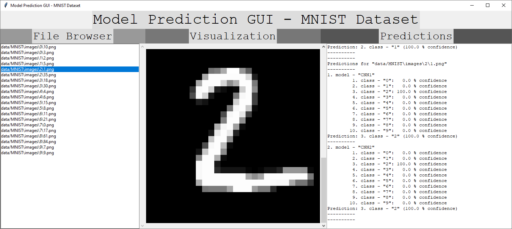

Model Prediction GUI
====================

Setup
-----

```
conda create -n Model_Prediction_GUI python=3.7 -c conda-forge --file requirements_conda.txt
conda activate Model_Prediction_GUI
pip install -r requirements_pip.txt
```


"requirements_conda.txt" and "requirements_pip.txt" were generated via

```
conda list --export > requirements_conda.txt
```

and

```
pip list --format=freeze > requirements_pip.txt
```

with

```
pillow
tk
```

and

```
h5py==2.10.0
tensorflow-gpu==2.1.0
```

(02/01/2022)


Usage
-----

```
python Model_Prediction_GUI.py <dataset>
```

e.g.,

```
python Model_Prediction_GUI.py data/MNIST/MNIST.json
```


Screenshots
-----------




License
-------

[MIT License](LICENSE.txt)


